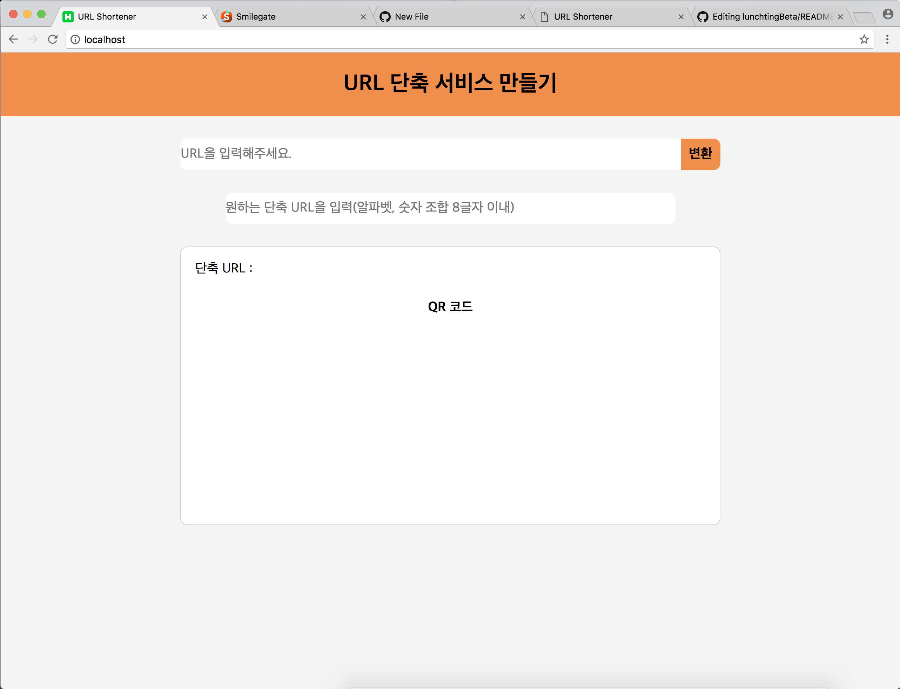
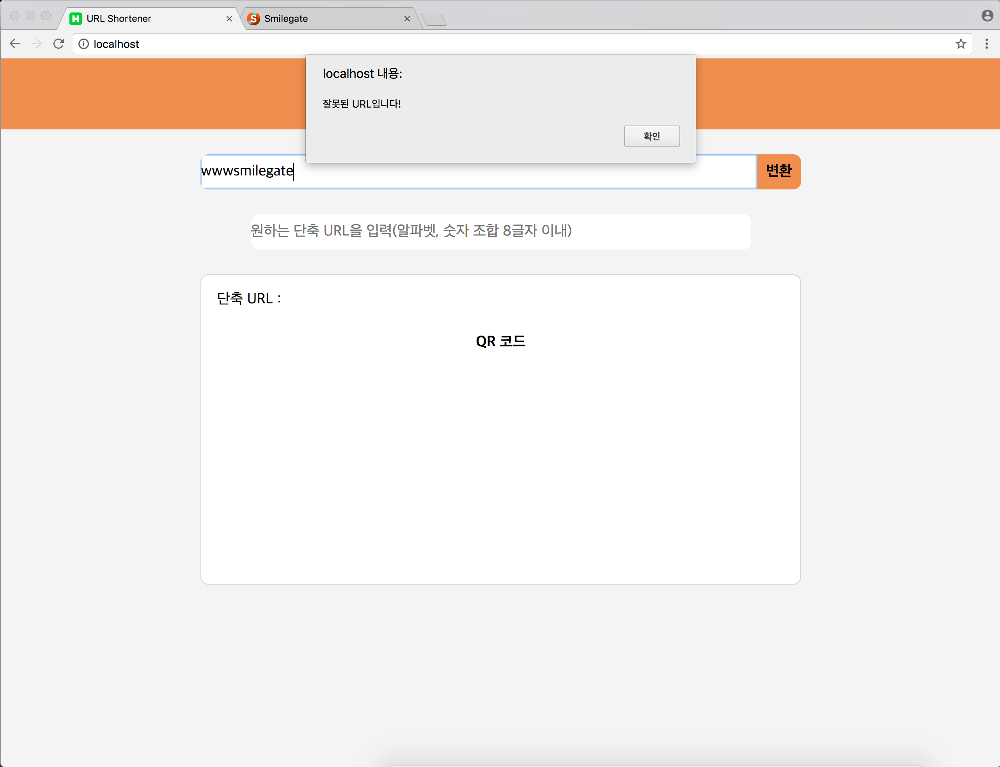
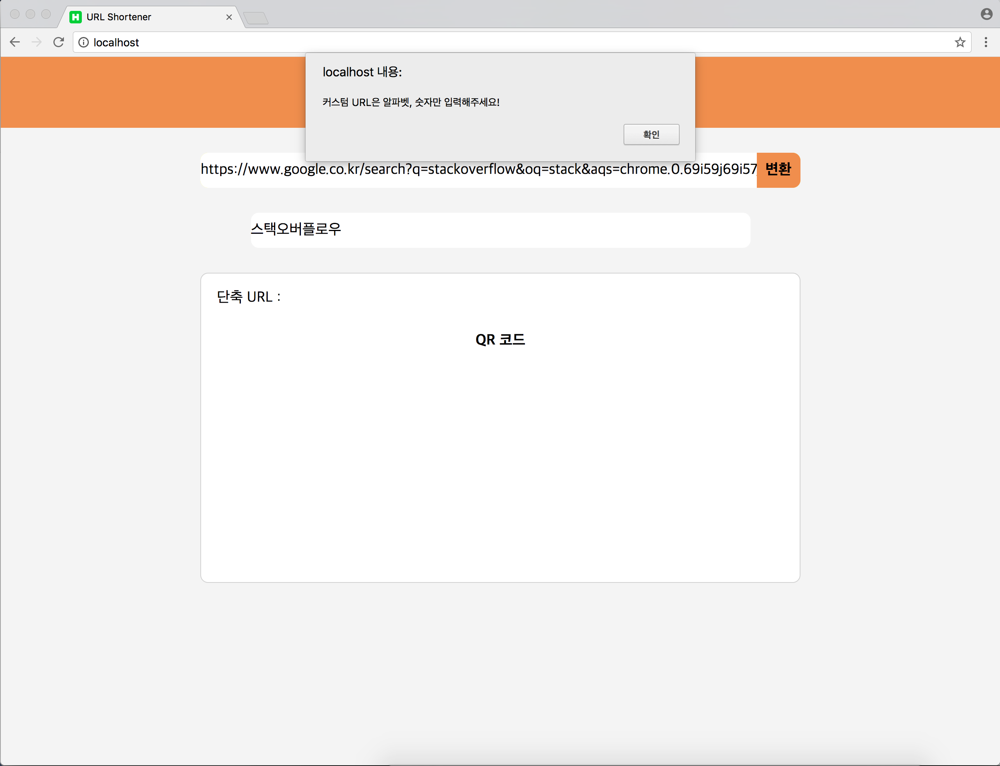
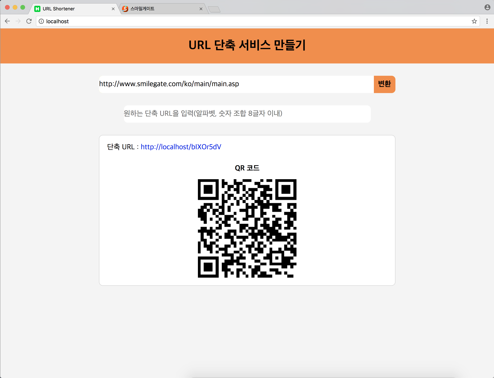
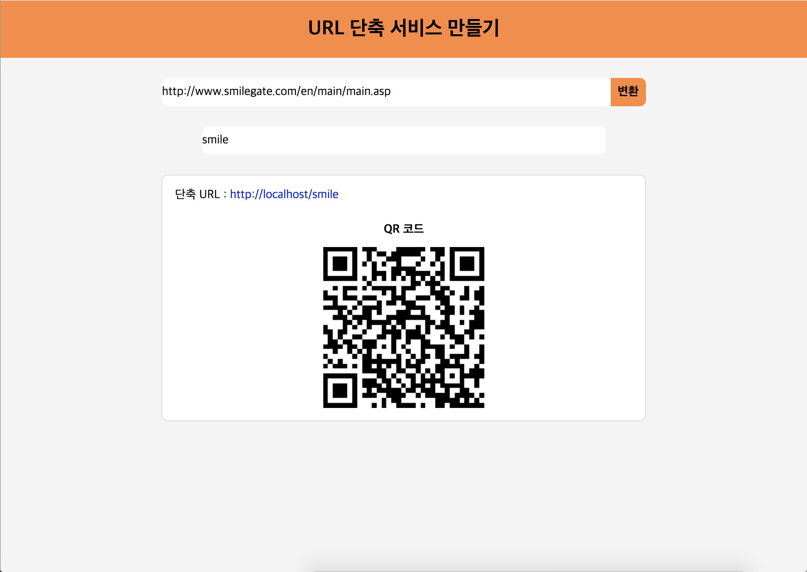
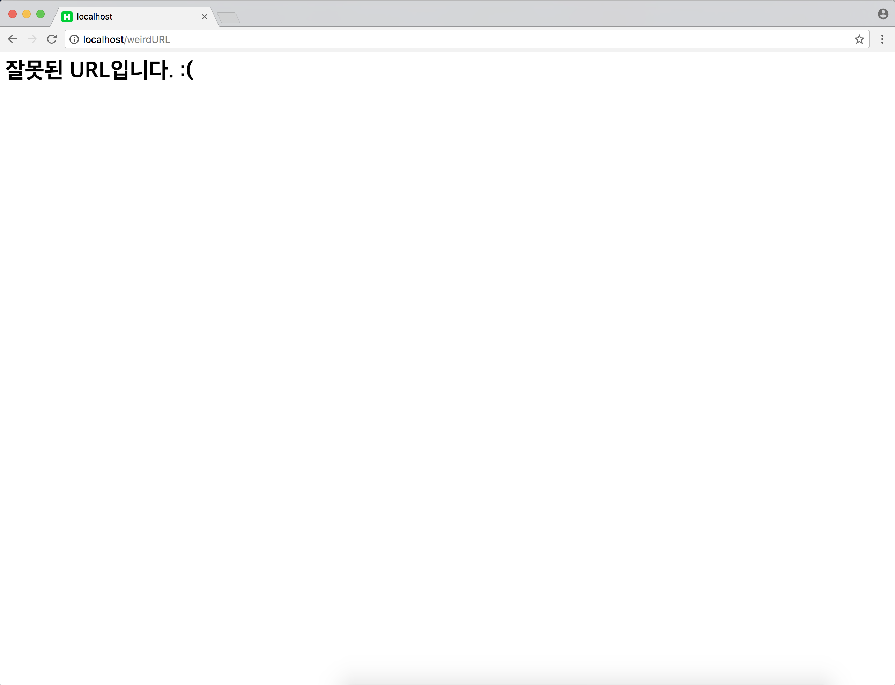

# 스마일게이트 서버개발캠프 과제 : URL 단축 서비스 만들기

### 요구사항
- URL 을 입력 받아 짧게 줄이고, 생성된 짧은 URL을 입력하면 원래의 URL로 리다이렉트 해주는 URL 단축 (URL shortening) 서비스를 개발하세요.

### 구현된 기능
- URL 입력 폼 제공
- 단축 후 결과 출력
- 동일한 URL을 입력 할 경우 항상 동일한 shortening 결과 값 출력
- shortening 의 결과 값은 8문자 이내로 생성
- 브라우저에서 shortening URL을 입력하면 원래 URL로 리다이렉트
- 도메인은 localhost 로 처리(소스코드는 localhost 기반. 실제 구동 확인은 아래의 캡쳐 및 링크를 참조)

AWS 클라우드 서버 배포 완료 : <a href="http://smile.heeham.com" target="_blank">http://smile.heeham.com</a>

### 추가한 기능
- URL 입력시 정상적인 URL 이 아니면 잘못된 URL 이라고 표시(잘못된 URL인 경우 & 등록되지 않은 단축 URL을 입력한 경우)
- QR 코드 구현

### 코드 설명
 사용자가 URL을 입력한 뒤 변환 버튼을 누르면 무작위로 8자 이내의 알파벳, 숫자 조합의 단축 URL을 생성해서 DB에 저장한 후 출력해줍니다. 이미 다른 사용자가 입력한 이력이 있어 DB에 저장되어 있는 경우 불러내어 출력해줍니다. 무작위가 아닌 커스텀 단축 URL을 원하는 경우에는 단축 URL을 함께 입력한 뒤 변환 버튼을 누르면 해당 단축 URL이 기존에 사용되지 않은 경우에만 적용됩니다.(이미 사용 중인 경우에는 무작위 단축 URL 리턴)

 웹 페이지 및 서버 모두에서 비동기 처리를 할 수 있게끔 코드를 작성했으며 사용자가 입력한 URL의 경우 ORM(Sequelize 라이브러리 : http://docs.sequelizejs.com )을 통해 MySQL DB에 저장됩니다. ORM을 사용하기 때문에 다른 RDBMS로 쉽게 변경할 수 있습니다.

무작위로 생성한 단축 URL이 이미 존재하는 경우 다시 무작위로 URL을 생성하여 재귀적으로 시도합니다.

### 추가 캡쳐화면

cf. BASE62
